# What this project can do

A guide to every feature, with pictures. Every picture comes from a real trace in [`tests/`](../tests).

**How to read the "Try it" lines:** "step 8" means the step counter at the top of the viewer says **8/…**.
Drag the slider, or press **→** until you get there.

## Contents

1. [What the project is](#1-what-the-project-is)
2. [How to use it](#2-how-to-use-it)
3. [A short tour of the screen](#3-a-short-tour-of-the-screen)
4. [Arrays](#4-arrays)
5. [Linked lists and structs](#5-linked-lists-and-structs)
6. [Memory](#6-memory)
7. [Reading it](#7-reading-it)
8. [Getting around](#8-getting-around)
9. [Catching bugs](#9-catching-bugs)
10. [Learning: predict mode](#10-learning-predict-mode)
11. [Machine level](#11-machine-level)
12. [Trace size](#12-trace-size)
13. [Every file in tests/](#13-every-file-in-tests)
14. [Not done yet](#14-not-done-yet)

---

## 1. What the project is

- **Two files** do all the work:
  - **`trace.py`** runs your C program inside **gdb** (the GNU debugger: a tool that can pause a program and look inside it).
    It stops after **every line**, writes down everything in memory, and saves it all to **`prog.json`**.
    That saved run is called a **trace**. Each saved moment is one **step**.
  - **`node_cards_viewer.html`** is a web page. It opens the trace and **draws** each step: your variables, your
    pointers as arrows, your `malloc`'d memory, and what each line did.
- **Nothing to install** for the viewer: open the `.html` file in your browser.
- Made for **small programs**: one `.c` file, a few hundred lines at most.

## 2. How to use it

1. **Compile** with debug info and no optimisation:
   ```sh
   gcc -g -O0 prog.c -o prog
   ```
   - **`-g`** keeps the names of your variables and lines, so gdb can find them.
   - **`-O0`** turns off optimisation, so every variable really lives in memory.
2. **Trace** it (in the folder where `trace.py` is, or give its path):
   ```sh
   gdb -q -batch -x trace.py ./prog
   ```
   - It prints `wrote prog.json and prog.json.gz with N steps`.
   - What your program prints goes to **`prog_stdout.txt`** (the viewer shows it too).
3. **Open** `node_cards_viewer.html` in a browser.
   - Click **Open trace** and pick **`prog.json`** (or `prog.json.gz`).
   - Click **Open .c file** and pick **`prog.c`**, so you can see each line as it runs.
   - Or just **drag both files** onto the page.
4. **Step** with **←** and **→**, or press **Space** to play.

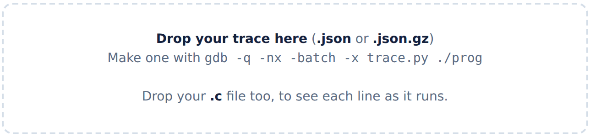

- **Limits:**
  - **x86-64 Linux** only (it reads x86-64 registers and glibc's heap).
  - It starts at **`main`** and stops after **4000 steps** (`MAX_STEPS` at the top of `trace.py`).
  - Only lines in **your one `.c` file** are steps. Library code (`printf`, `malloc` …) runs without stopping.

## 3. A short tour of the screen

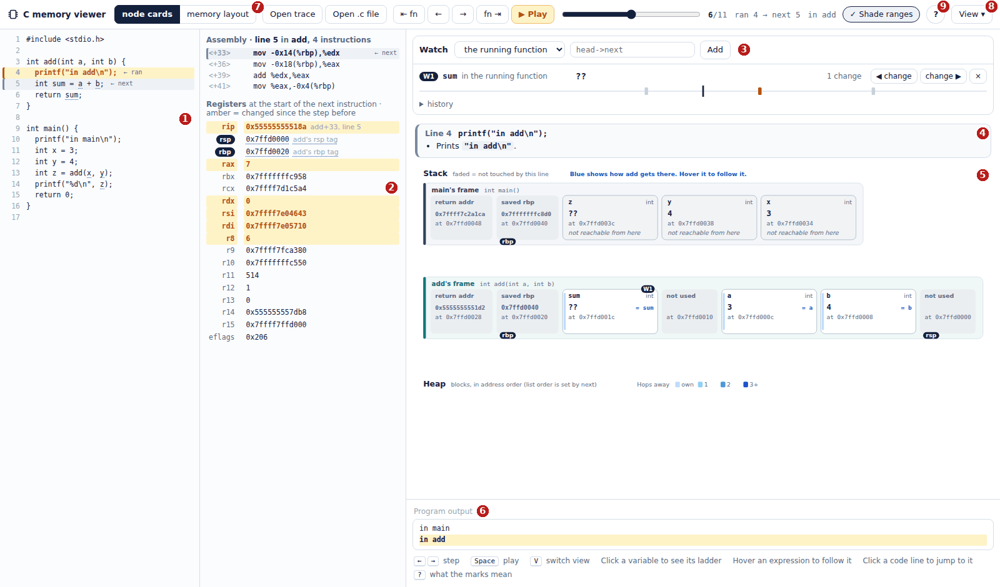

- **Everything is about one line:** the line that **just ran** is **amber** in the code; the line that runs **next** is grey.

| # | Part | What it is |
|---|---|---|
| 1 | **Code pane** | Your `.c` file. Amber = just ran, grey = runs next. A red **●** marks a line where a bug happens. |
| 2 | **Assembly panel** | The machine instructions of the next line, and the CPU's registers (turn it on in **View**). See [Machine level](#11-machine-level). |
| 3 | **Watch panel** | Type a name like `head->next` to follow it through the whole run. See [Watch panel](#watch-panel). |
| 4 | **Words panel** | "Line in words": what the line that just ran did, in plain English, with the real values. |
| 5 | **Cards view** | The main picture. **Stack** on top (one box per function call), **heap** below (one card per `malloc`'d block). |
| 6 | **Console** | What your program printed so far. The newest line is amber. |
| 7 | **View switch** | **node cards** (the picture) or **memory layout** (the raw bytes). Key: **V**. |
| 8 | **Menu** | **View ▾**: settings, stepping modes, zoom. |
| 9 | **Help** | **?**: what every colour and mark means. Key: **?**. |

- **Stack:** the memory where each function keeps its **local variables**. Each running call has its own **frame** (its own box).
- **Heap:** the memory that **`malloc`** hands out and **`free`** takes back.

### Memory view

- The same step, as **raw bytes**: 8 bytes per row, with each row's address on the left.
- Each byte is shown in **hex** (base 16: `0a` is 10, `ff` is 255).
- **Little-endian:** the lowest byte of a number comes first, so `10 00 00 00` is the int 16.

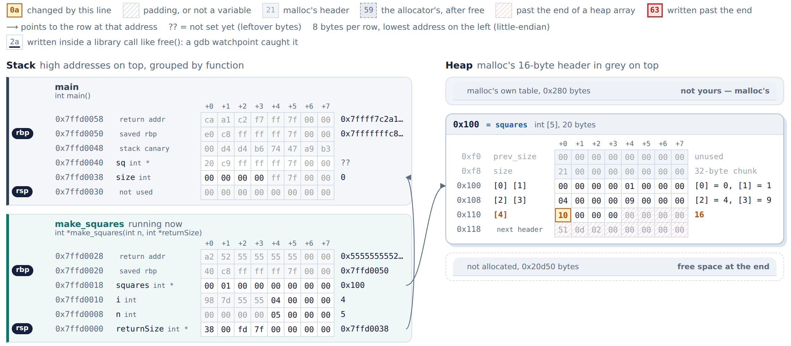

### Menu

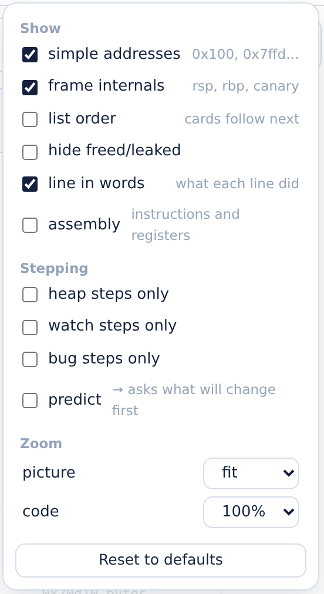

### Help

- Press **?** for the full list of marks. **Esc** closes it.

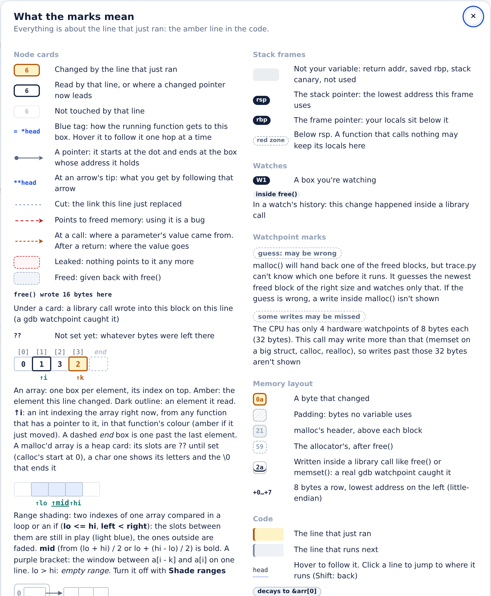

---

## 4. Arrays

### Slots

- An array is drawn as **one box per element** ("slot"), with its **index** `[0] [1] [2]` on top.
- Works for arrays on the **stack** (`int a[5]`) and on the **heap** (`malloc`).

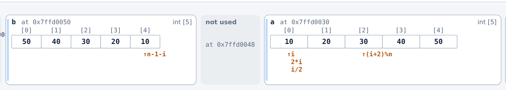

- **Try it:** `tests/index_exprs.c`, **step 18**.
- **Limits:** only the first **16** slots are drawn; the rest is one **"+N more"** box (see [array fields](#array-fields-in-structs)).

### "??": not set yet

- **`??`** means **nobody wrote this element yet**. The bytes there are just leftovers.
- Each slot turns into a real value **the moment a line writes it**.

![squares[3] and squares[4] are still ??](img/arr-unset.png)

- **Try it:** `tests/toy_fill.c`, **step 8**.
- **Limits:** "set yet" is worked out from your source code and from bytes that change. If a slot gets written with the
  value that was already there, by code the viewer can't read, it may stay `??`.

### Changed-slot highlight

- The slot the line just **changed** is **amber**, and its new value pops in.
- Hover it to see **what it was before**.
- Works even when the write goes **through a pointer**: here `swap` writes `a[i]`, and `main`'s `vals[0]` lights up.

![swap() writes a[i]; main's vals[0] turns amber](img/arr-changed.png)

- **Try it:** `tests/toy_swap.c`, **step 6**.

### Read outline

- A slot the line **read** (but didn't change) gets a **dark outline**.

![int last = squares[4]: squares[4] outlined, last amber](img/arr-read.png)

- **Try it:** `tests/toy_fill.c`, **step 14**.
- **Limits:** reads are found by reading your code (`a[i]`, `*p`, `*(a + 2)`), so it needs the `.c` file.

### ↑i markers

- **`↑i`** under a slot: the int `i` is indexing this array **right now**, and points at this slot.
- Works **across functions**: here `swap`'s `i` and `j` show on `main`'s `vals`, because `swap` has a pointer to it.
- Each function has its **own colour**; a marker turns **amber** when it just moved.
- A dashed **end** box appears when an index sits **one past the last element**.

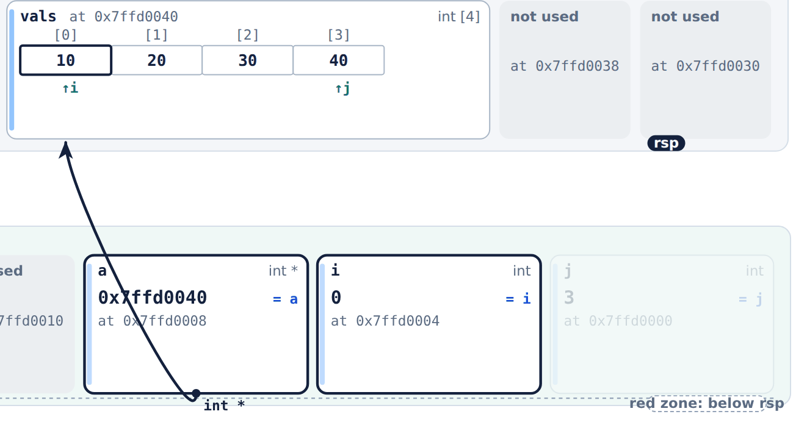

- **Try it:** `tests/toy_swap.c`, **step 5**.
- **Limits:** without the `.c` file, only ints with index-like names (`i`, `j`, `k`, `lo`, `hi`, `mid` …) become markers.

### Index expressions

- Not just `a[i]`: the marker shows the **whole expression** from your code, worked out with today's values.
- Examples from the test: **`b[n-1-i]`**, **`a[(i+2)%n]`**, **`a[2*i]`**, **`a[i/2]`**, **`c[c[i]]`**.

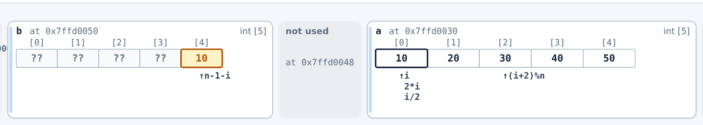

- **Try it:** `tests/index_exprs.c`, **step 7**.
- **Limits:** only `+ - * / %`, brackets and indexing. No function calls inside the `[ ]`.

### Range shading and mid

- Two indexes of one array compared in a **loop or an if** (`lo < hi`, `left <= right`):
  - the slots **between** them are **light blue** (still in play),
  - the slots outside are **faded** (ruled out).
- **`mid`** is **bold and underlined**: a variable called `mid`, or one set by `(lo + hi) / 2` or `lo + (hi - lo) / 2`.
- When `lo > hi` the box says **"empty range"**.
- Turn it off with the **Shade ranges** chip at the top.

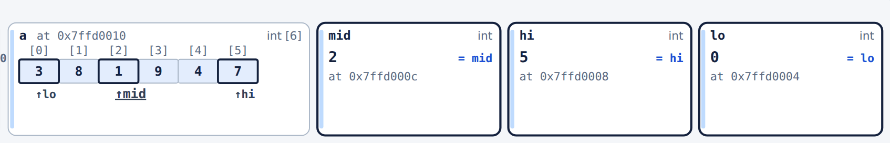

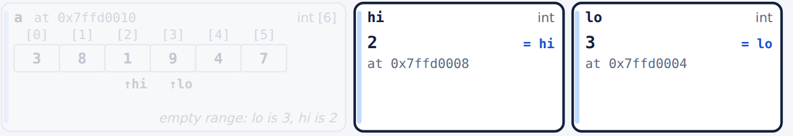

- **Try it:** `tests/two_pointers.c`, **step 9**, and **step 22** for the empty range.
- **Limits:** the two names must be a known pair (`lo/hi`, `low/high`, `left/right`, `l/r`, `start/end`, `begin/end`,
  `first/last`, `i/j`) or both be used as indexes of that array.

### Windows

- A line that reads **`a[i]` and `a[i - 3]`** gets a **purple bracket** over the window between them, and those slots
  are light purple.

![sum += a[i] - a[i - 3]: the window a[0]…a[3]](img/arr-window.png)

- **Try it:** `tests/sliding_sum.c`, **step 8**.
- **Limits:** the gap must be a plain number (`i - 3`), not a variable (`i - k`).

### Out-of-bounds alerts

- **Out of bounds** means using an index past the end of the array (like `heap[5]` when there are only 5 elements, `0…4`).
- **Before** it happens: a red bar says **"about to write past the end"**.
- **After** it happens: **"wrote past the end"**, with how many bytes past the end changed.
- In the memory view, the byte that was hit is **red**.

![The red bar on the line before heap[n] = 99 runs](img/arr-oob-next.png)

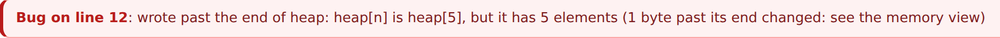

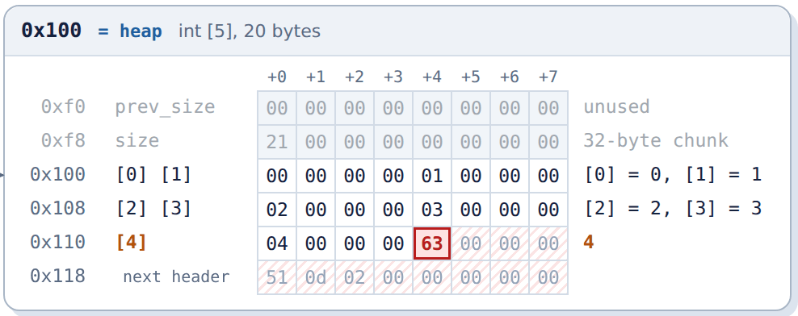

- **Try it:** `tests/out_of_bounds.c`, **steps 18 and 19** (heap), **steps 20 and 21** (stack array).
- **Limits:**
  - Only **writes** are caught. **Reading** past the end is not flagged.
  - The byte check after a **stack** array only looks at the next 16 bytes (a write like `a[k]` with a bad `k` is still caught from the code).

### Heap arrays

- A block from **`malloc`** (or `calloc`, `realloc`) that an `int *` or `char *` points to is drawn as a **heap card with slots**.
- **`malloc`**: every slot starts as **`??`**.
- **`calloc`**: every slot starts as **0**.
- **`realloc`**: the part it **copied** keeps its values, the new part is **`??`**.

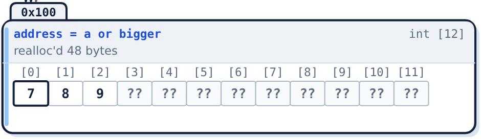

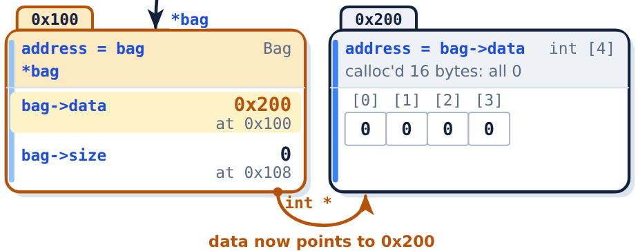

- **Try it:** `tests/leak_array.c`, **step 11** (realloc), `tests/bag.c`, **step 8** (calloc), `tests/make_squares.c`, **step 18** (malloc).
- **Limits:**
  - Element types: integers, `char` and pointers. **Not `double` or `float`.**
  - Only the first **2048 bytes** of a block are saved.
  - A `void *` isn't followed, so a block only reached through `void *` isn't drawn.

### Strings

- A **char array** shows **one letter per slot**, and the **`\0`** (the zero byte that ends every C string).
- A stack char array also shows its text in quotes above the slots, like `"hello"`.
- Slots after the `\0` are greyed out: they are leftovers, not part of the string.

![A malloc'd char[6] after strcpy: h e l l o \0](img/arr-str-heap.png)

![char word[8] = "hello" on the stack](img/arr-str-stack.png)

- **Try it:** `tests/heap_string.c`, **step 6**, and `tests/toy_walk.c`, **step 27**.

### String literals

- A **string literal** is text written in quotes in your code, like `"hello"`. It is stored inside the program file,
  in **read-only memory** (memory you may read but not write).
- A `char *` that points at one shows the **text** and a **read-only** tag.
- **`char *words[] = {"cat", "dog", "bird"}`**: each slot shows the string it points to.

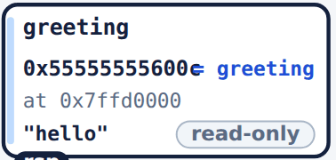

![char *words[]: each slot's string above it](img/arr-literal-words.png)

- **Try it:** `tests/heap_string.c`, **step 6**, and `tests/words.c`, **step 12**.
- **Limits:** the text is cut at **64 bytes**.

### Grids

- **`int **grid`** (an array of row pointers, each pointing to a row): a **column of row pointers** on the left, an arrow
  from each to its row, and the rows lined up. **`i→`** marks the row in use, **`↑j`** the column.
- **`char **`**: each row is a string.
- **`int grid[2][3]`** and **`char board[3][3]`** on the stack: the same grid, inside one box.
- Rows may have **different lengths** (see `tests/ragged.c`).

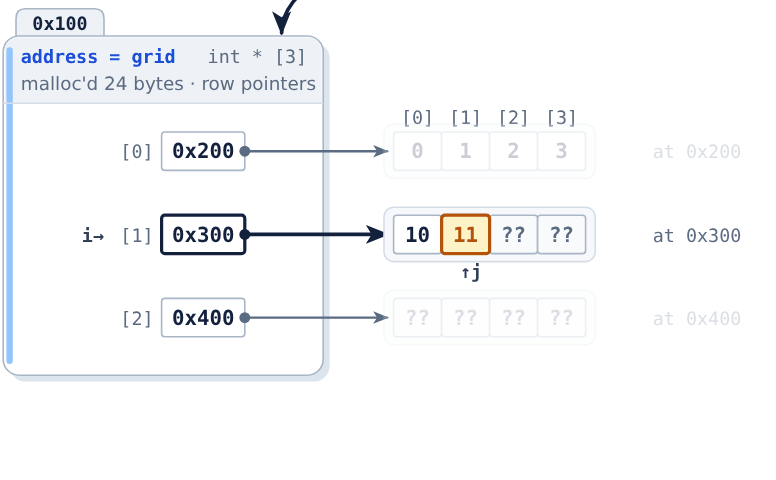

![char **copy: three strings, copy[1][0] just became 'f'](img/arr-grid-char.png)

![int grid[2][3] on the stack, with ps[0] and ps[1] pointing at its rows](img/arr-grid-2d.png)

![char board[3][3]](img/arr-board.png)

- **Try it:** `tests/grid.c` **step 31**, `tests/words.c` **step 24**, `tests/grid2d.c` **step 9**, `tests/board.c` **step 29**.
- **Limits:** 2 dimensions at most. An `int cube[2][3][4]` is shown as plain text.

### Struct arrays

- **`struct pair a[4]`**: each slot is a **little card** with one line per field.
- Each field is **`??`** until it is set, and only the field that changed turns amber.

![a[1].val just set; a[1].idx still ??](img/arr-structs.png)

- **Try it:** `tests/pairs.c`, **step 9**.

### Array fields in structs

- An array **inside a struct** (`struct ring { int buf[5]; int n; }`) gets slots too, in a stack box or a heap card.
- It has everything a normal array has: indexes, `??`, highlights, `↑i`, out-of-bounds checks.
- More than 16 elements: a **"+N more"** box.

![c.seen[20] in a struct on the stack: 16 slots, then "+4 more"](img/arr-fields.png)

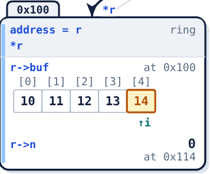

- **Try it:** `tests/ring.c`, **step 50** (stack) and **step 34** (heap).

---

## 5. Linked lists and structs

A **struct** groups several values under one name. A **linked list** is a chain of structs ("nodes") where each one has
a pointer, usually called **`next`**, to the next one.

### List line

- Above the heap, one line per list: **`head: 2 → 1 → 0 → NULL (3 nodes)`**.
- It starts from every variable that points to a first node.

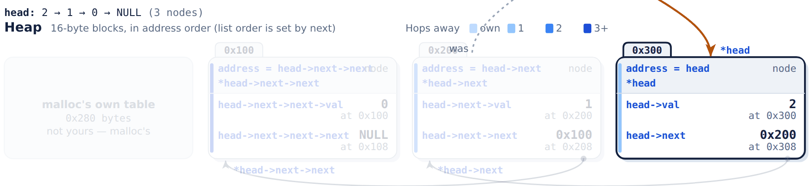

- **Try it:** `tests/toy_list.c`, **step 20**.
- **Limits:** a node needs **one** pointer to its own type (any name), or exactly two called `next` and `prev`
  (or `nxt`/`fwd`, `previous`/`back` …). At most 40 nodes are listed.

### List order

- Normally heap cards are in **address order**.
- Turn on **View → list order** and the cards **follow `next`**, so the arrows stop crossing.

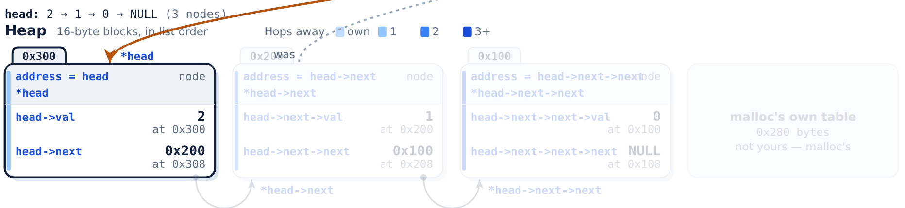

- **Try it:** `tests/toy_list.c`, **step 20**, then tick **list order**.

### Doubly linked lists

- A **doubly linked list** has `next` **and** `prev` (a pointer back to the node before).
- Cards are in `next` order, **`next` arrows below**, **`prev` arrows above**.
- The list line uses **`⇄`** where two nodes point at each other: `1 ⇄ 2 ⇄ 3 ⇄ 4 → NULL`.

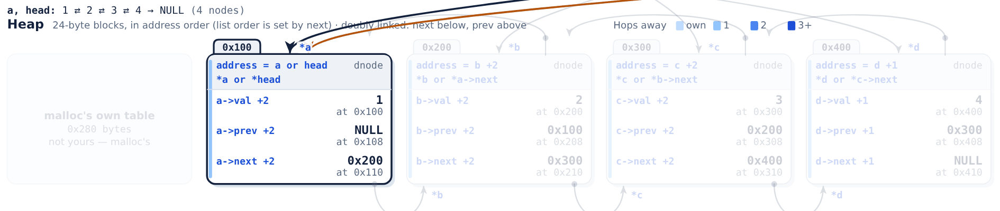

- **Try it:** `tests/dlist.c`, **step 46**.

### Broken prev links

- If a node's `prev` doesn't point back to the node before it, that arrow is **red** with a **⚠** note,
  like **"0x300's prev doesn't point back to 0x200"**.
- While a node is being **inserted**, the half-done links show up red too, and turn normal when the insert is finished.

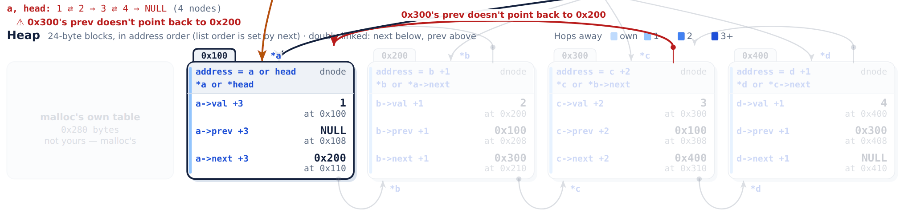

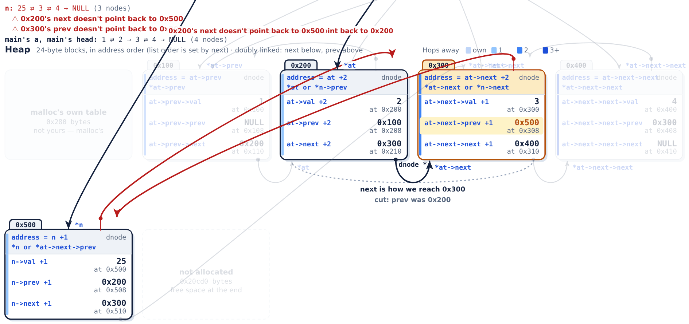

- **Try it:** `tests/dlist_broken.c`, **step 45**, and `tests/dlist.c`, **step 61**.

### Circular lists

- A **circular list**: following `next` comes back to the first node.
- The list line ends in **`(back to 1)`** and the last arrow **curves back** under the cards to the first card.

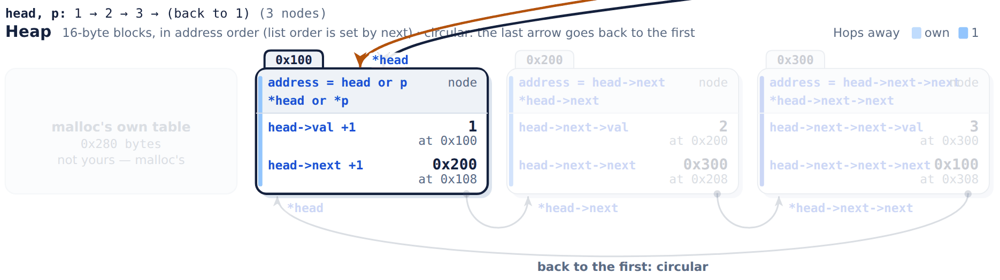

- **Try it:** `tests/circular.c`, **step 28**.

### Cycles into the middle

- The last `next` points to an **earlier node**, not the first (a "ρ" shape, like the Greek letter rho).
- The list line ends in **`(back to 2)`**, the arrow curves back to that node, and it gets a **↻ loop start** tag.

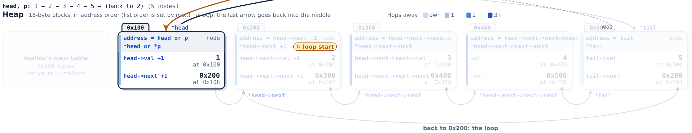

- **Try it:** `tests/rho.c`, **step 55** (a wide window helps: the 5 cards need about 1900 pixels).

### struct list_head and container_of

- **Kernel-style lists** (the way the Linux kernel does it): instead of a `next` to the item, each item holds a small
  **`struct list_head { next, prev }`**, and the links point at that field inside the next item.
- **`container_of(p, struct item, list)`** is the trick that gets back from the `list` field to the whole item.
- The viewer draws arrows **landing on the `list` field**, and hovering one says which item it's in:
  *container_of(…, struct item, list) = 0x100*.
- A `list_head` on the stack or a global is the list's **head** (a **sentinel**: not an item, just the start and end of
  the circle). The list line reads **`items: 10 ⇄ 20 ⇄ 30 → (back to items)`**.

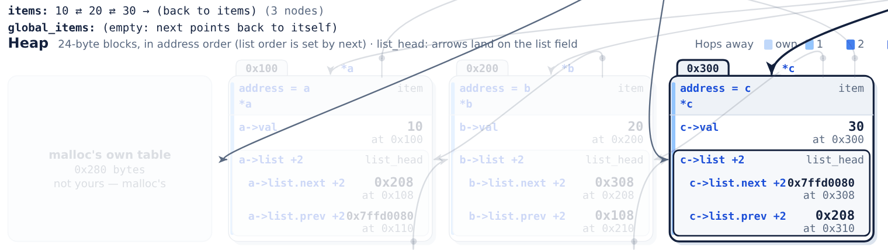

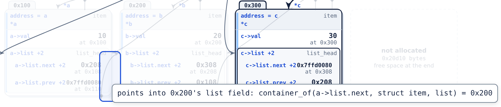

- **Try it:** `tests/klist.c`, **step 68**, and **step 95** for the global list.
- **Limits:** the item type must be a struct defined in your `.c` file.

### Structs inside structs

- A struct field that is **itself a struct** (`struct point pos` inside `struct item2`) gets **its own box** inside the card.
- Its fields have their own highlights and `??`, and are named like **`first->pos.x`**.
- A struct variable on the **stack** shows its fields one per line.

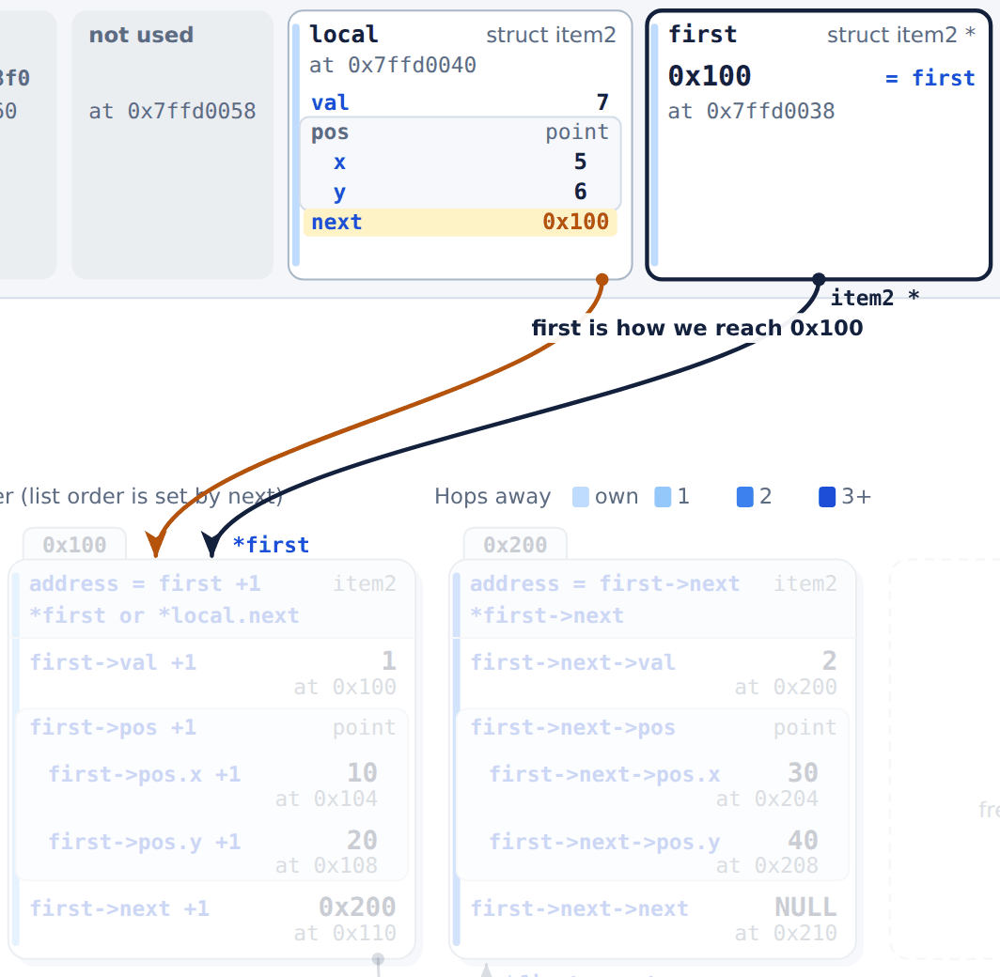

- **Try it:** `tests/nested.c`, **step 26**.
- **Limits:** 3 levels deep at most.

### Anonymous typedef structs

- **`typedef struct { int *data; int size; } Bag;`** (a struct with no name of its own, only a `typedef` name) works
  like any other struct: the card is called **Bag**.

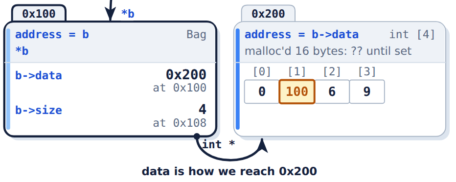

- **Try it:** `tests/bag_typedef.c`, **step 21**.

### Trees

- A struct with **`left` and `right`** (or `lchild`, `rchild`) pointers to its own type is drawn as a **tree**:
  root on top, children below, left to right.
- A dashed **NULL** stub marks a missing child.
- Freed nodes **keep their place**, so you can watch the tree being freed.

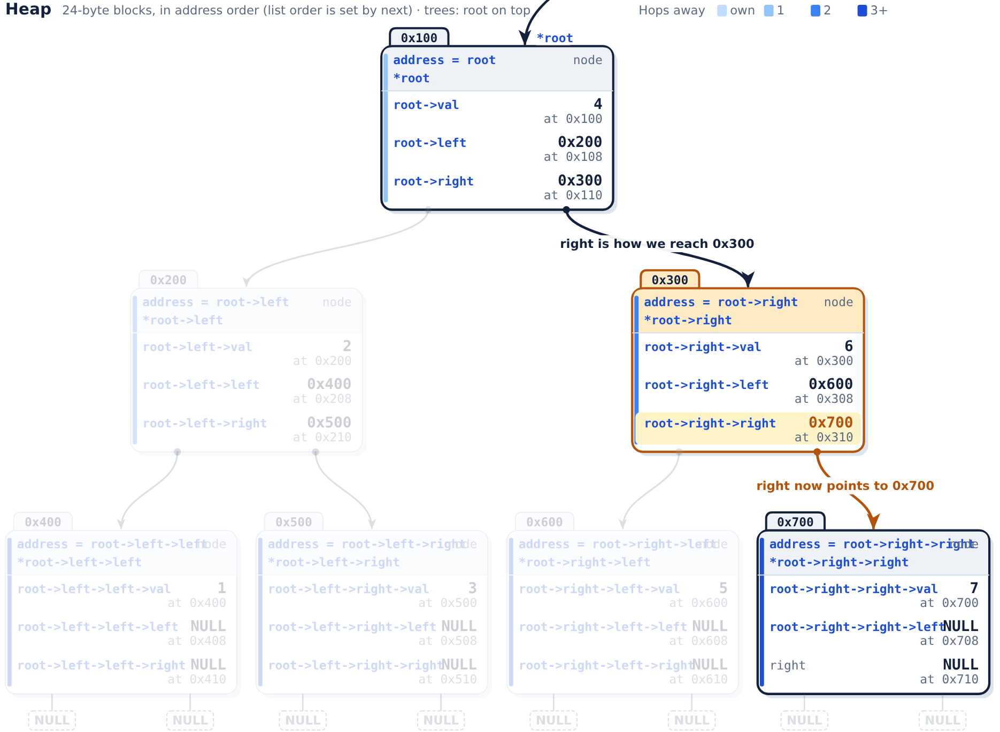

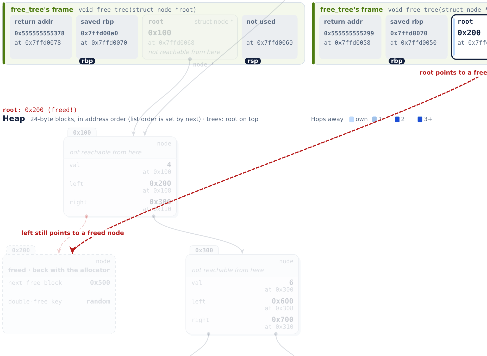

- **Try it:** `tests/tree.c`, **step 65** (built) and **step 180** (being freed).

---

## 6. Memory

### Stack frames and frame internals

- Each function call has its own **frame**, in its **own colour** (`main` is always slate). Its C signature is on top.
- Besides your variables, a frame holds things the compiler adds. They are drawn as **grey boxes**:
  - **return addr** (return address): where the program goes back to when this function ends.
  - **saved rbp**: the caller's frame pointer, saved so it can be put back.
  - **stack canary**: a random number placed next to your arrays. If a buffer overflow changes it, the program stops when the function returns.
  - **not used**: padding no variable uses.
- **`rsp`** (stack pointer) and **`rbp`** (frame pointer) tags show the bottom and the base of the frame.
- **Red zone**: a function that calls nothing may keep its locals **below rsp**; a dashed bracket marks them.
- Turn the grey boxes off with **View → frame internals**.

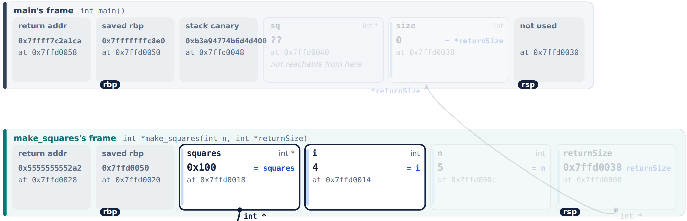

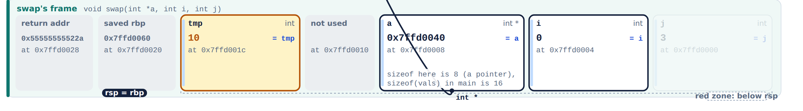

- **Try it:** `tests/make_squares.c`, **step 18**, and `tests/toy_swap.c`, **step 5**.
- **Limits:** frames bigger than **512 bytes** don't show their internals. Deep recursion wraps the frames into rows
  (`tests/deep_recursion.c`).

### Globals

- **Global** and **static** variables of your file sit in their own **Globals** box above the frames.
- They can be reached by name from every function.

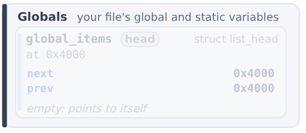

- **Try it:** `tests/klist.c`, **step 68**.

### Heap blocks and chunk headers

- **Heap chunk:** each block `malloc` gives you sits inside a bigger "chunk" with a **16-byte header** just above it.
  The header holds the chunk's **size** (and some flags in its low bits).
- The **memory view** shows each block with its header (`prev_size`, `size`), the block's bytes, and the **next chunk's header**.
- The cards view also shows chunks that are **not yours**: **"malloc's own table"** (the **tcache**, see below) and
  **"not allocated"** (free space at the end of the heap).

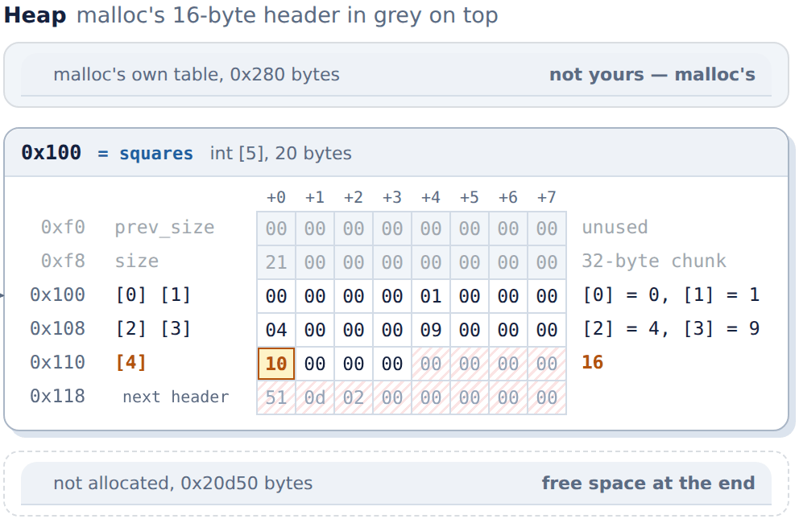

- **Try it:** `tests/make_squares.c`, **step 18**, memory layout view.
- **Limits:** glibc only (the C library on most Linux systems).

### Freed blocks

- A freed block stays on screen with a **dashed border**: **"freed · back with the allocator"**.
- **tcache:** glibc's list of recently freed blocks, kept for reuse. `free()` writes two things into your block:
  - **next free block**: a link to the next block in that list,
  - **double-free key**: a random value that helps catch a double free.
- Pointers that still hold a freed address get a **red dashed arrow**: using them is a bug.

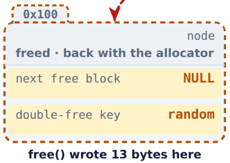

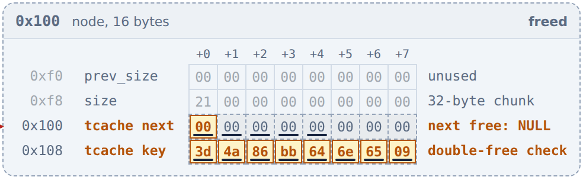

- **Try it:** `tests/toy_heap.c`, **step 6**.

### Leaks

- **Leak:** a block that was never freed and that **no pointer points to any more**, so it can never be freed.
- The card gets a **red dashed border** and **"leaked: nothing points here"** the moment the last pointer to it is lost.
- On the **last step**, a **leak report** lists every block that was never freed, and the line where it was lost.
  See [Leaks in Catching bugs](#leaks-report).

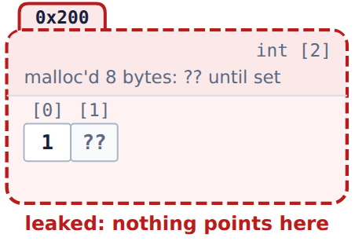

- **Try it:** `tests/leak_array.c`, **step 36**.

### Watchpoint marks, "guess" and "some writes may be missed"

- **Watchpoint:** a CPU feature that stops the program the moment it **writes to an address**. `trace.py` puts them on
  your memory just before a library call (`free`, `malloc`, `strcpy`, `memset` …), so you see what the library wrote.
- Under a card: **"strcpy() wrote 5 bytes here"**. In the memory view those bytes are **underlined**.
- **"guess: may be wrong"**: `malloc` will reuse a freed block, but `trace.py` can't know which one before it runs.
  It guesses the newest freed block of the right size and watches only that one.
- **"some writes may be missed"**: the CPU has only **4 watchpoints of 8 bytes** (32 bytes). A call that writes more
  (a big `memset`, `calloc`, `realloc`) may write bytes that aren't shown.

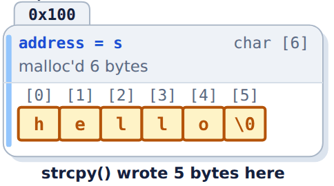

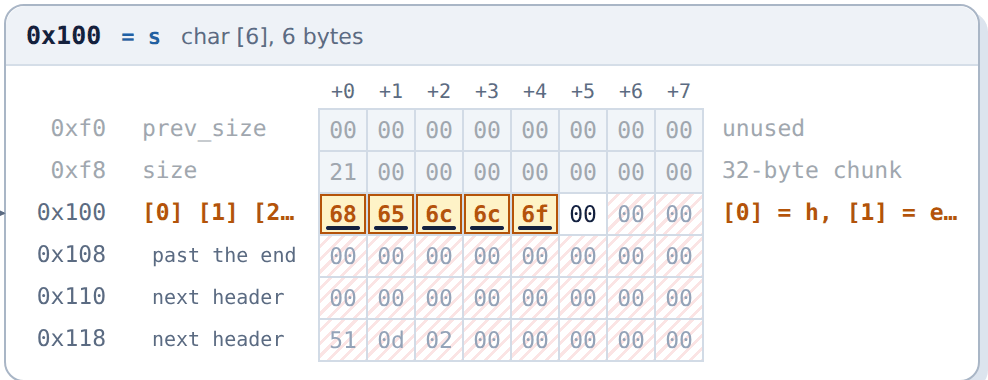

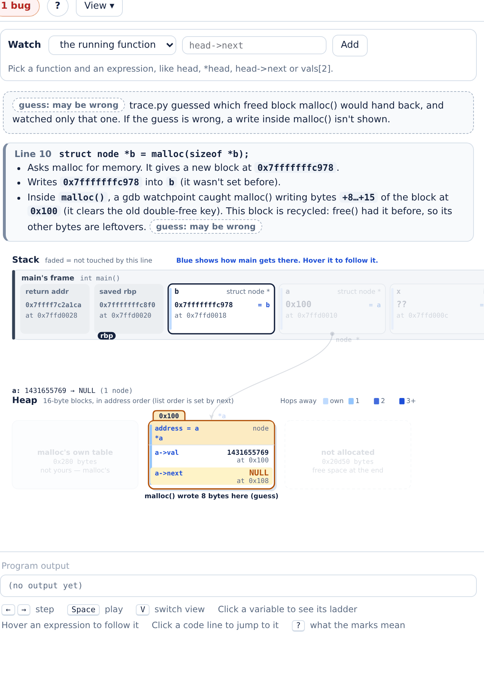

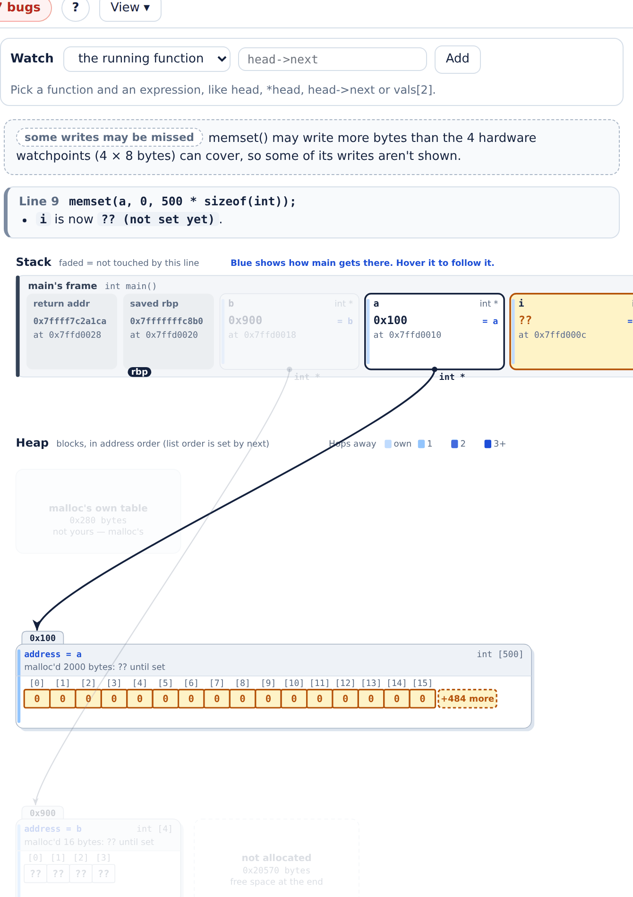

- **Try it:** `tests/heap_string.c` **step 6**, `tests/toy_heap.c` **step 7**, `tests/heap_overflow_free.c` **step 7**.
- **Limits:** if the computer doesn't allow hardware watchpoints (some virtual machines), `trace.py` goes on without
  them and these marks don't appear.

---

## 7. Reading it

### Addresses: simple vs real

- **Address:** the number that says where a box lives in memory. Real ones are long, like `0x5555555592a0`.
- **Simple addresses** (on by default) make them short and easy to tell apart:
  - heap blocks: **`0x100`, `0x200`, `0x300`** …,
  - the stack: **`0x7ffd…`**,
  - globals: **`0x4000`** ….
- Distances stay real: a field 8 bytes into block `0x100` is `0x108`.
- `%p` output in the console is rewritten the same way (hover it to see the real one).
- Turn it off with **View → simple addresses**.

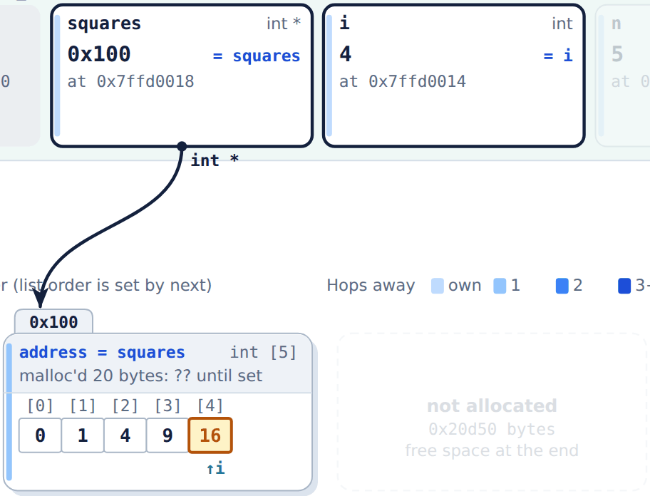

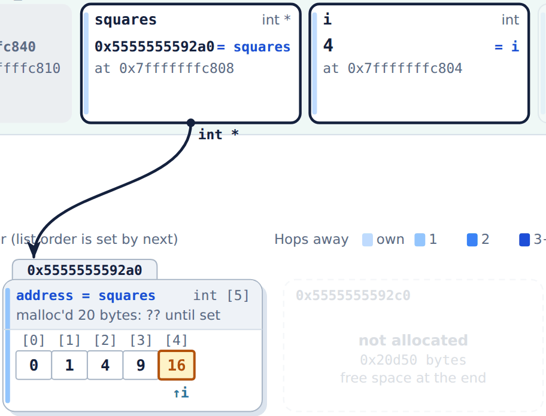

- **Try it:** `tests/make_squares.c`, **step 18**.

### Hops

- **Hover an expression** in the code (they are underlined with dots), like `root->left->right`.
- The viewer follows it **one hop at a time** (one hop = following one pointer): each box on the way gets a numbered
  circle **1, 2, 3**, and the arrows light up blue.
- The tooltip says the value, the type, and **how many arrows** it followed.

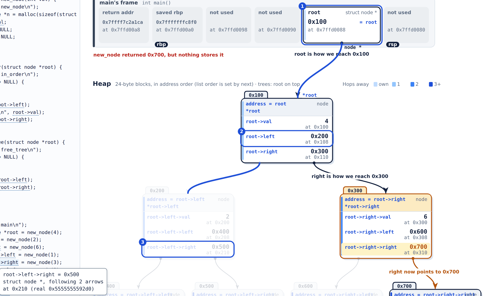

- **Try it:** `tests/tree.c`, **step 65**, hover `root->left->right` on line 45.
- **Limits:** only `*`, `&`, `->`, `.`, `[ ]` and `( )`. No arithmetic like `p + 1`.

### Reach labels

- The **blue tags** say how the **running function** gets to each box: `= head`, `*head`, `head->val`, `head->next`.
- A card's top says **`address = head`**. When there are two ways, it says `head or p`.
- A **blue bar** on the left of a box shows how many hops away it is (light = its own variable, dark = 3 or more).
- A box the running function **can't reach** is grey and says **"not reachable from here"**.

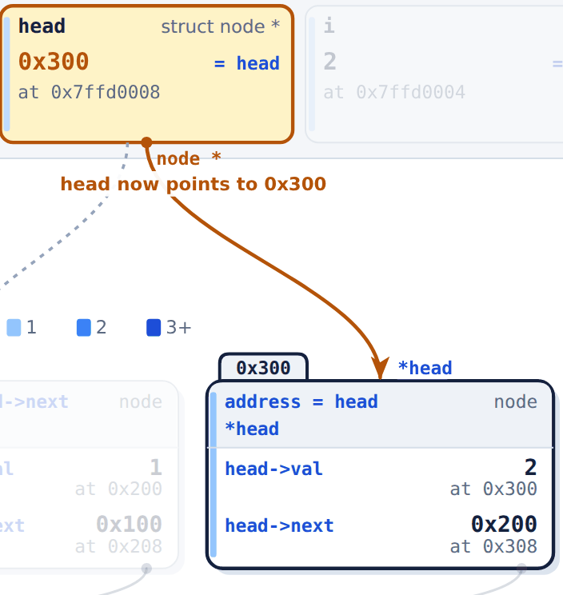

- **Try it:** `tests/toy_list.c`, **step 20**.

### printf panel

- **Hover any box**: under the tooltip, the **`printf` lines** that print its **value** and its **address** from the running
  function, and **what they would print now**.
- **Click** the box to **pin** the panel, with a **Copy** button per line. **Esc** lets go.

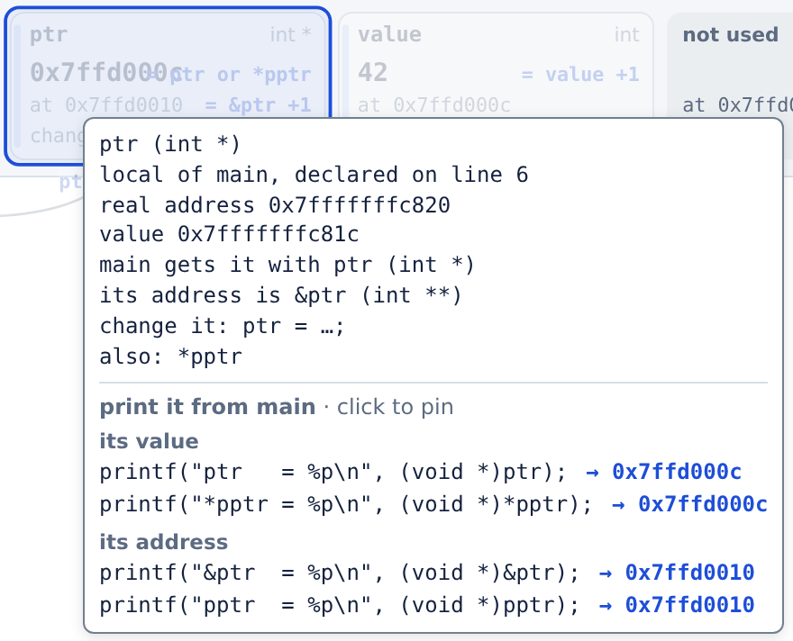

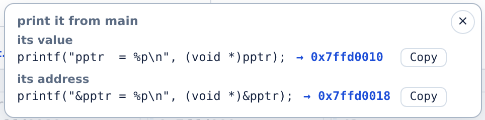

- **Try it:** `tests/print_pointers.c`, **step 16**. Compare with what the program printed in the console.

### Ladder

- **Click a variable**: the **ladder** lists `&x`, `x`, `*x`, `**x` …, with each value and type, one rung per `*`.
- Its **Watch** button adds it to the [Watch panel](#watch-panel).

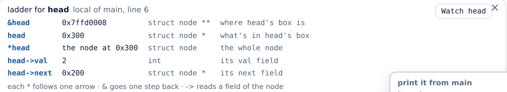

- **Try it:** `tests/toy_list.c`, **step 20**, click `head`.

### Types on arrows

- Every arrow from a variable has its **pointer type** written where it starts, like **`int *`** or **`node *`**.
- Active arrows also get a sentence: **"head now points to 0x300"**, **"a points to a freed block"**.

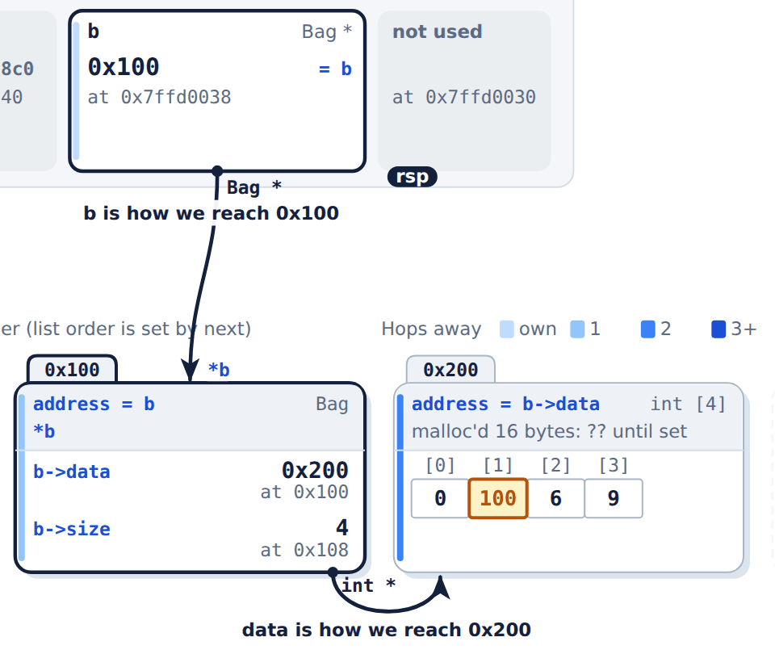

- **Try it:** `tests/bag_typedef.c`, **step 21**.

---

## 8. Getting around

### Menu settings

- **View ▾** holds every setting. They are **remembered** next time (in your browser).
- **Show:** simple addresses, frame internals, list order, hide freed/leaked, line in words, assembly.
- **Reset to defaults** puts everything back.


### Heap, watch and bug steps only

- In **View → Stepping**, tick one to make **← →** skip the steps that don't matter:
  - **heap steps only**: steps where something on the heap changed,
  - **watch steps only**: steps where a watched value changed,
  - **bug steps only**: steps with a bug.
- **⇤ fn** and **fn ⇥** jump to the previous / next step in a different function.
- **Click a code line** to jump to the next time it runs (**Shift**-click: the time before).

### Watch panel

- Pick a function (or "the running function"), type an expression like **`head`**, **`head->next`** or **`vals[2]`**, press **Add**.
- Each watch shows its **value now**, how many times it **changed**, a **timeline** of the changes (click it to jump),
  **◀ change / change ▶** buttons, and a **history** table.
- The watched box gets a **W1**, **W2** … badge.
- A change made inside a library call says so: **"inside free()"**.

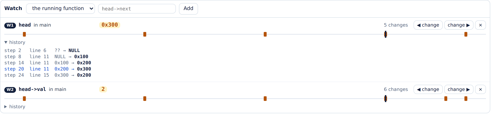

- **Try it:** `tests/toy_list.c`, watch `head` in `main`.

### Zoom

- **View → Zoom → picture** (fit, 75% … 200%) and **code** (100% … 200%).

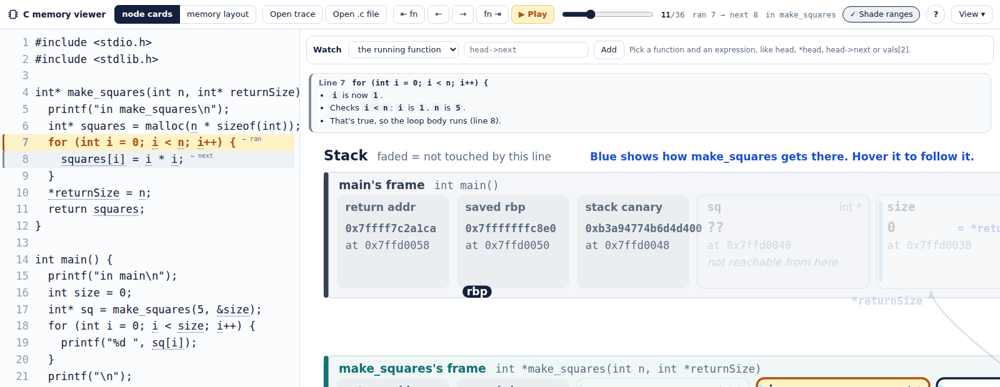

### Remembering your place

- Close the page and open the same trace again: you're back on **the same step**.
- Your settings, zoom and watches are remembered too.

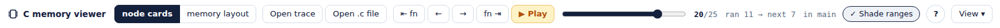

- **Limits:** it's stored in **this browser only**, by file name and number of steps.

---

## 9. Catching bugs

- A red **"N bugs"** pill at the top: click it to jump to the next bug.
- A **red bar** above the picture explains the bug on this step, with **◀ ▶** to go between bugs.
- A red **●** next to a line number marks a line where a bug happens.
- Also caught: **reading a variable before it's set** ("reads x before it's set"). No test in `tests/` shows it yet.

### Double free

- **Double free:** calling `free()` twice on the same block. glibc notices and **aborts** (stops) the program.
- The bar says **"free(0x100) a second time: it was already freed on line 6 (step 8)"**, and the pointer is outlined red.

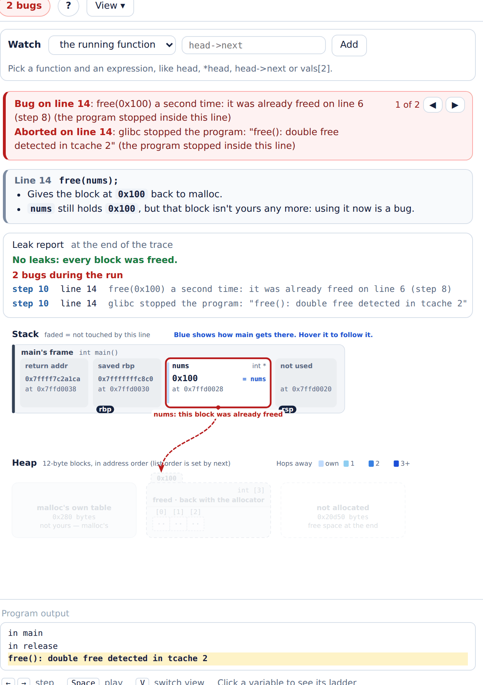

- **Try it:** `tests/double_free.c`, **step 10**.

### Bad free

- **Bad free:** calling `free()` on an address that never came from `malloc`, like the address of a stack variable.

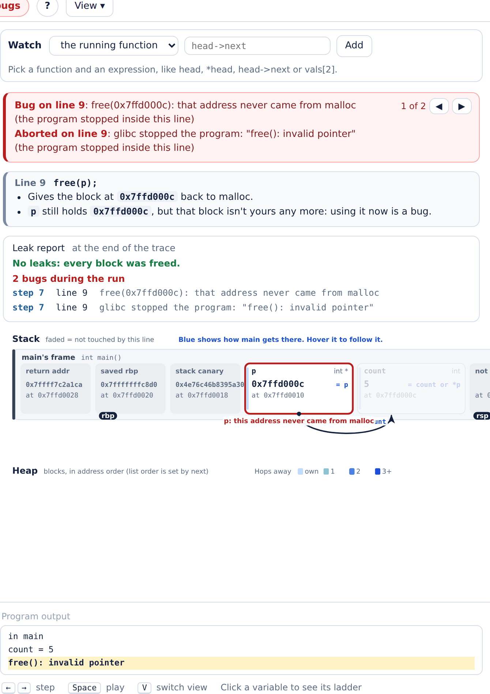

- **Try it:** `tests/bad_free.c`, **step 7**.

### Use after free

- **Use after free:** reading or writing a block **after** it was freed. Often it doesn't crash, which makes it sneaky.
- The bar says which expression did it and where the block was freed.

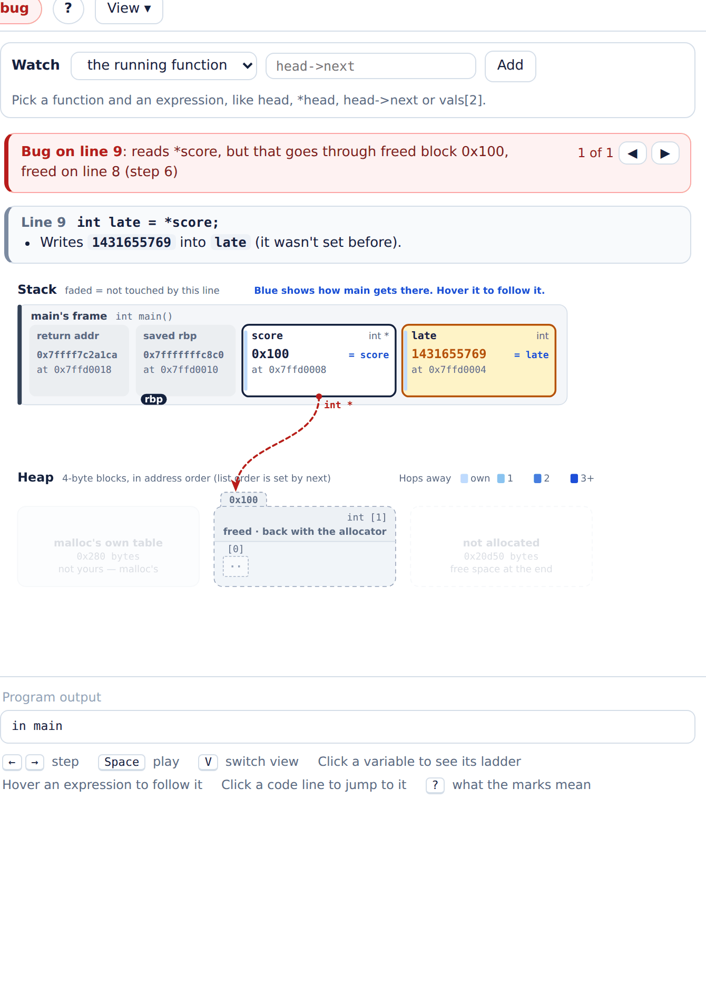

- **Try it:** `tests/use_after_free.c`, **step 7**.
- **Limits:** found by following the expressions on the line; it needs the `.c` file.

### Crash replay (SIGSEGV / SIGABRT banners)

- When the program **crashes**, `trace.py` takes **one last picture** on the line that crashed.
- **SIGSEGV** ("segmentation fault"): the program touched memory it may not use. The banner says **which address**
  and **which pointer** caused it: *"tried to read address 0x0 (NULL): second was NULL"*. That box is outlined red.
- **SIGABRT** ("aborted"): glibc found a broken heap and stopped the program. The banner quotes **glibc's own message**,
  like *"free(): invalid next size (normal)"*.

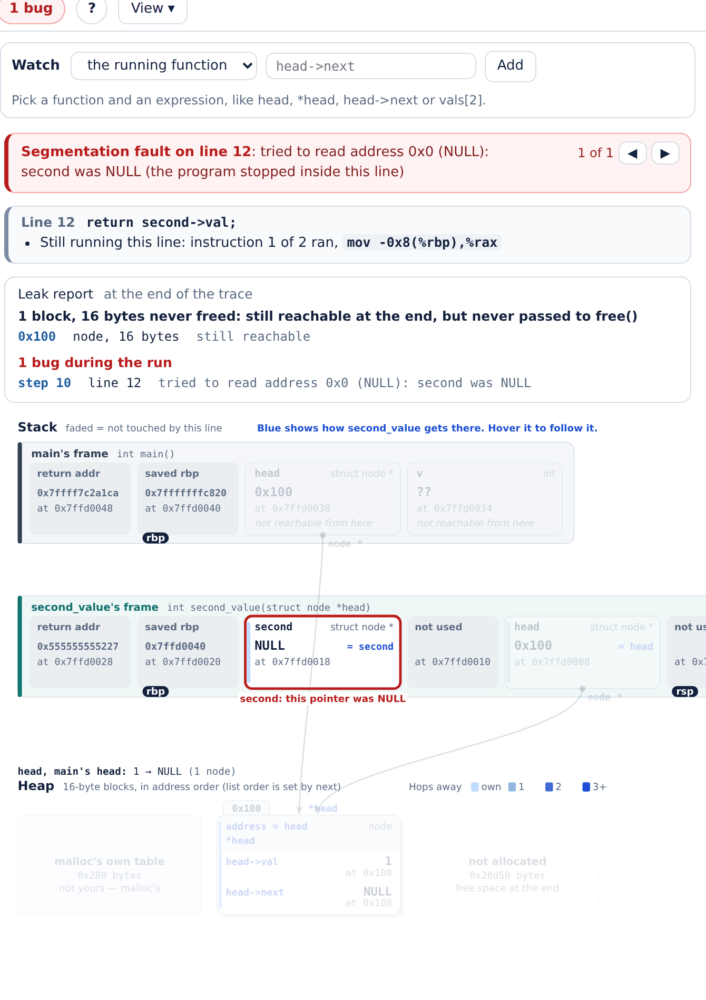

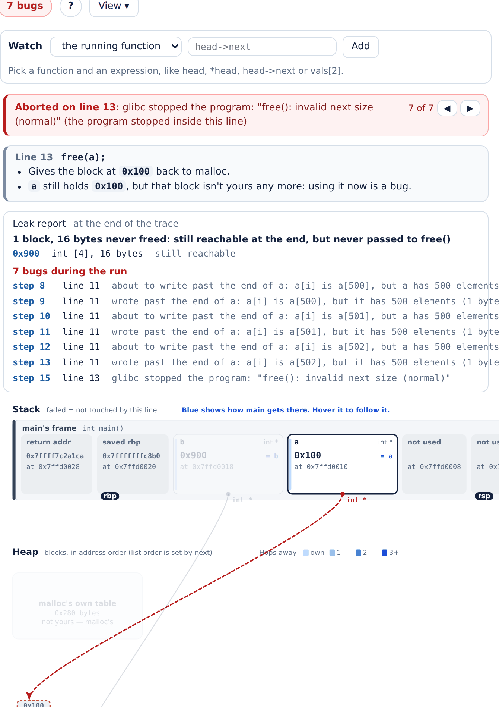

- **Try it:** `tests/null_read.c`, **step 10**, and `tests/heap_overflow_free.c`, **step 15**.
- **Limits:** other signals (SIGFPE, SIGBUS, SIGILL) get a banner with their name, but no test shows them.

<a id="leaks-report"></a>
### Leaks

- On the **last step**, the **leak report**:
  - **lost** blocks (nothing points to them): with the line where they were lost,
  - **never freed** blocks (still reachable, but never passed to `free`),
  - the **list of bugs** of the whole run (click one to jump there).
- "**No leaks: every block was freed.**" when all is well.

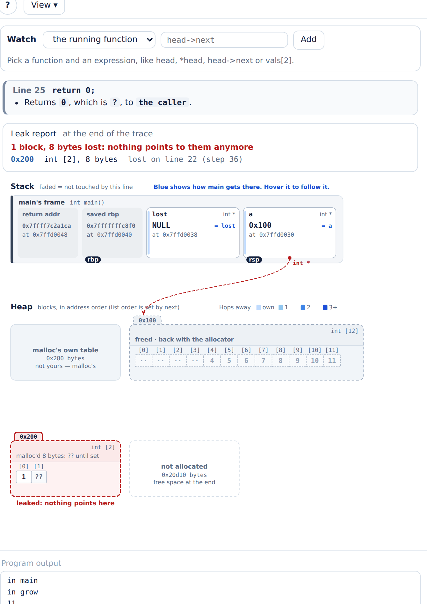

- **Try it:** `tests/leak_array.c`, **last step (39)**.

---

## 10. Learning: predict mode

- Turn on **View → predict**. Now **→** first **asks**: *which boxes will change on line 6?*
- **Click** the boxes you think will change (a variable, a field, an array slot, a heap card), then press **→** again.
- The answer:
  - **green**: you picked it and it changed,
  - **amber**: it changed but you didn't pick it,
  - **red**: you picked it but it didn't change.
- A **score** in the corner adds up: **"Predict: 7 of 9 right"**.
- **←** and **Play** never ask.

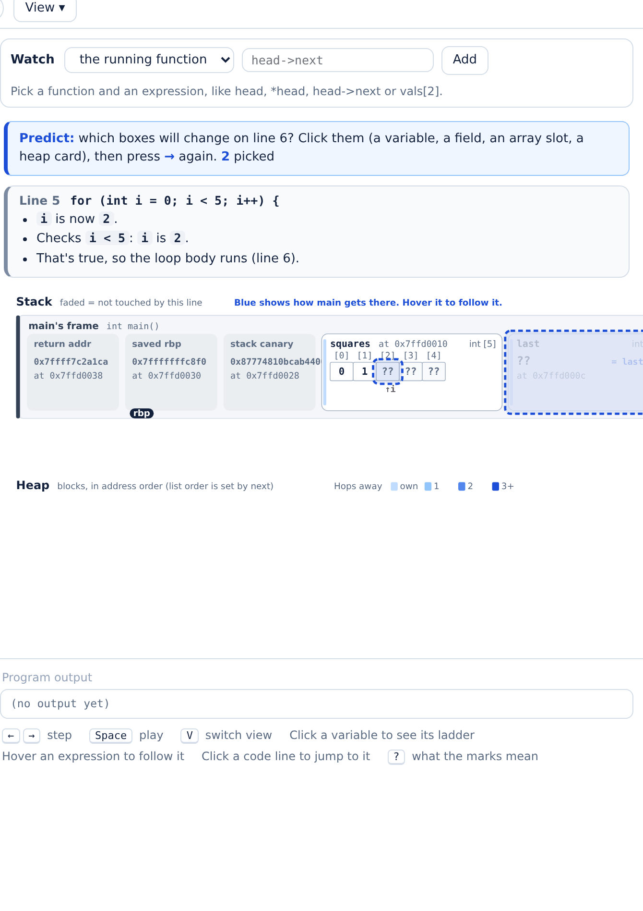

![The answer: squares[2] right (green), last wrong (red), and the score](img/predict-reveal.png)

- **Try it:** `tests/toy_fill.c`, go to **step 7**, turn on predict, press →.
- **Limits:** the score starts again when you open another trace.

---

## 11. Machine level

### The Assembly panel

- Turn on **View → assembly**.
- **Assembly** is the list of **machine instructions** (the tiny steps the CPU really runs) that the compiler made from one C line.
- The panel shows the **next line's** instructions, with their offset in the function (`<+33>`), and **← next** on the
  one that runs next.
- After a crash: **← crashed here** on the instruction that crashed.

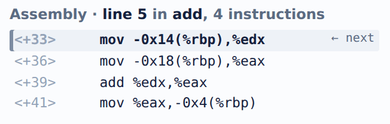

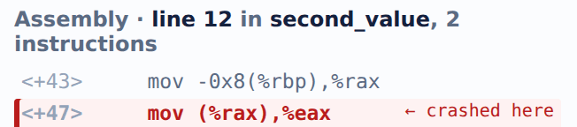

- **Try it:** `tests/add.c` with `tests/add.json`, **step 6**; `tests/null_read.c`, **step 10**.
- **Limits:** only traces made with the newest `trace.py` have machine code (`add`, `add_insn` and `null_read` in `tests/`). Older ones say "this trace has no machine code".

### The registers table

- **Register:** a tiny, very fast storage spot inside the CPU, with a name like `rax` or `rsp`.
- The table shows all 18 (`rip`, `rsp`, `rbp`, `rax` … `r15`, `eflags`), at the start of the next instruction.
- **Amber** = changed since the step before. Hover one for what it's for (`rdi`: 1st argument, `rax`: return value …).
- A register that holds an address says **what it points at** (like *add's rsp tag*). **Click it** to see that box flash.
- **`eflags`** lists the flags that are on: `ZF` (zero), `SF` (negative), `CF` (carry), `OF` (overflow).

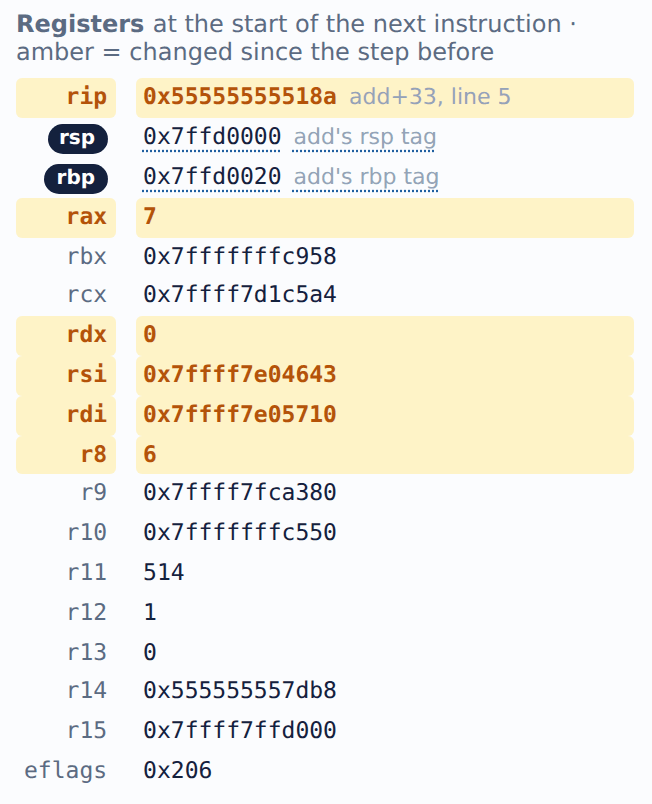

- **Try it:** `tests/add.c`, **step 6**.

### STEP_INSN = True

- Set **`STEP_INSN = True`** at the top of `trace.py` to make **one step per machine instruction** instead of one per line.
- Mid-line steps say **"Still running this line: instruction 1 of 4 ran"**.
- Good for **small** programs only: the trace gets many more steps.

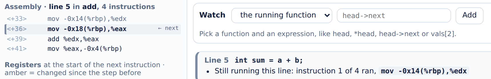

- **Try it:** open `tests/add_insn.json` with `tests/add.c`, **step 21**.

---

## 12. Trace size

- **`COMPACT = True`** (the default, at the top of `trace.py`) makes traces **smaller**:
  - each step stores only the **new output** (not everything printed so far),
  - a frame, a heap block, the chunk list, the globals or the registers that **didn't change** are stored as `{"same_as_prev": true}`.
  - The viewer puts it all back when it opens the trace.
- `trace.py` also writes **`prog.json.gz`**, a **gzip**-compressed copy (gzip is a common way to squeeze files). The viewer opens it directly.
- Numbers from `tests/README.md`: all the test programs together went from **5.08 MB** (full) to **1.90 MB** (compact)
  to **60 KB** (`.json.gz`).
- Use **`COMPACT = False`** when you want to **read the `.json` yourself** or feed it to another tool: every step is then
  complete on its own.


- **Try it:** open `tests/print200.json.gz` (605 steps, 200 printed lines).
- **Limits:** opening `.json.gz` needs a recent browser (one with `DecompressionStream`).

---

## 13. Every file in tests/

- **`tests/README.md`**: notes on each test, and the trace sizes.
- **`tests/run_traces.sh`**: rebuilds and traces every `.c` file (`./run_traces.sh`), or just some (`./run_traces.sh bag.c`).
- Each **`name.c`** has its trace **`name.json`** next to it. Some also have **`name.json.gz`**.

| Program | What it tests |
|---|---|
| `add.c` | A function call; turn on **assembly** to see instructions and registers (also `add.json.gz`) |
| `add_insn.json` | The same program traced with `STEP_INSN = True` (open it with `add.c`; also `add_insn.json.gz`) |
| `bad_free.c` | `free()` of a stack address: the bad-free banner, glibc aborts |
| `bag.c` | `struct Bag { int *data; int size; }`: a field pointing into a `calloc`'d array, `mid = data + 2` |
| `bag_typedef.c` | The same with an anonymous `typedef struct { … } Bag;` |
| `board.c` | `char board[3][3]`: a char grid on the stack |
| `circular.c` | A circular list of 3 nodes, walked, then cut and freed |
| `deep_recursion.c` | 13 frames on the stack at once: frames wrap into rows |
| `dlist.c` | A doubly linked list: build, insert in the middle, delete |
| `dlist_broken.c` | A doubly linked list with one wrong `prev`: the red arrow and warning |
| `double_free.c` | Freeing a block twice: the double-free banner, glibc aborts |
| `grid.c` | A 3×4 `int **` grid: row pointers and rows |
| `grid2d.c` | `int grid[2][3]` and `int *ps[2]` pointing at its rows |
| `heap_overflow_free.c` | Writing 3 ints past a 500-int block: out-of-bounds alerts, then glibc aborts in `free` |
| `heap_string.c` | `malloc(6)` + `strcpy`: char slots, `\0`, watchpoint marks, a read-only string literal |
| `index_exprs.c` | `b[n-1-i]`, `a[(i+2)%n]`, `a[2*i]`, `a[i/2]`, `c[c[i]]` |
| `klist.c` | Kernel-style lists: `struct list_head`, `container_of`, a global list head |
| `leak_array.c` | `realloc` keeping the copied part, and a leaked array |
| `make_squares.c` | A `malloc`'d int array returned to `main`, `int *returnSize` |
| `nested.c` | Structs inside structs: `it->pos.x`, `local.pos.y` |
| `null_read.c` | Reading through a NULL pointer: the SIGSEGV banner (also `null_read.json.gz`) |
| `out_of_bounds.c` | Writing past the end of a heap array and a stack array |
| `pairs.c` | `struct pair a[4]`: an array of structs |
| `print200.c` | 200 printed lines: compact output per step (also `print200.json.gz`) |
| `print_pointers.c` | The printf panel, checked against what the program printed |
| `ragged.c` | Rows of different lengths, and `int **returnColumnSizes` |
| `rho.c` | A list whose tail points back into the middle (ρ shape) |
| `ring.c` | Array fields in structs, on the stack and on the heap, and "+4 more" |
| `sliding_sum.c` | `a[i] - a[i - 3]`: the window |
| `toy_big.c` | A 20-element array: "+4 more" |
| `toy_fill.c` | A stack array filled in a loop |
| `toy_heap.c` | `malloc` reusing a freed block, then a use after free |
| `toy_list.c` | A linked list built by pushing to the front |
| `toy_mixed.c` | An array next to a linked list |
| `toy_rec.c` | An array passed down a recursion |
| `toy_swap.c` | Swapping elements through a pointer, two indexes `i` and `j` |
| `toy_walk.c` | A pointer walking an array, and a `char word[8]` |
| `tree.c` | A 7-node tree: built, printed in order, freed |
| `two_pointers.c` | `lo` and `hi` walking inward: range shading, `mid`, empty range |
| `use_after_free.c` | Reading a block after `free()`: the use-after-free banner |
| `words.c` | `char *words[]` of literals and a `malloc`'d `char **` copy |

- Also in the repo root: **`remove_element.c`** and **`remove_element.json`**, made by an older `trace.py`, to check old
  traces still open.

---

## 14. Not done yet

Features that don't exist yet:

- **fork**: following a child process. Only the first process is traced.
- **Threads**: only one thread is followed.
- **Several .c files**: only the file with `main` is stepped. Functions in other files run without stopping.
- **Memory map**: one picture of the whole address space (code, globals, heap, stack).
- **Quiz**: questions about the program, beyond predict mode.
- **Compare two runs**: two traces side by side.
- **Try-an-expression box**: type any C expression and see its value on this step.
- **Hash tables**: an array of lists drawn as buckets.
- **Big arrays**: only 16 slots are drawn and 2048 bytes of a heap block are saved.
- **double / float**: their boxes show **—** instead of a number.
- **bool**: shows as **0 / 1**, not `true` / `false`.
- **qsort**: seeing what `qsort` does to an array, and the calls to your compare function.
- **Binary view**: the bits of a number, `0b0000_1010`.
- **Function pointers**: shown as a plain address, with no arrow to the function.
- **Bit fields**: no special support. A field like `int flag : 1` is read as if it were a whole `int`.
